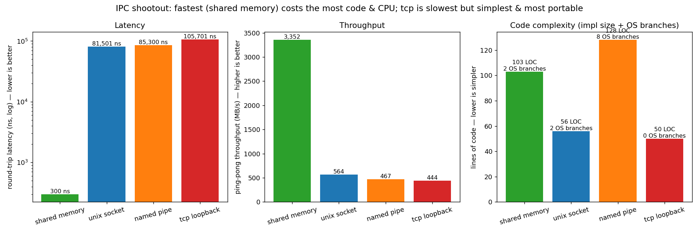

# ipc-shootout

[](https://github.com/aviNaftalis/ipc-shootout/actions/workflows/ci.yml)

A **cross-platform C++23 benchmark of inter-process communication mechanisms.**
Same two-process ping-pong over four transports — **shared memory, Unix-domain
socket, named pipe, and TCP loopback** — measuring **latency, throughput, and
code complexity**, with notes on the **pros, cons, and portability** of each.
Builds and runs on **Linux and Windows** (proven in CI on every push).



## Results

12-core machine (WSL2 / g++ 15.2). *Median* round-trip is inflated by scheduler
jitter on this host; *best* is closer to the mechanism's true floor. Windows
numbers are produced by the CI run (see the Actions tab).

| mechanism | RTT median | RTT best | throughput | code | OS branches | portability |
|---|--:|--:|--:|--:|--:|---|
| **shared memory** | **0.3 µs** | **<0.1 µs** | **3350 MB/s** | 103 LOC | 2 | both (separate mapping APIs) |
| **unix socket** | 82 µs | 8.6 µs | 564 MB/s | 56 LOC | 2 | Linux/macOS native, Win 10 1803+ |
| **named pipe** | 85 µs | 8.6 µs | 467 MB/s | 128 LOC | 8 | both — but two different APIs |
| **tcp loopback** | 106 µs | 20 µs | 444 MB/s | 50 LOC | 0 | universal |

Shared memory is **~250× lower latency** because the data never crosses the
kernel on the hot path — the others pay two context switches per round trip. It
pays for it in **code** (you write your own sync + framing) and **CPU** (the
busy-wait spin pins a core). TCP is the slowest but the simplest and the only
one with *zero* OS-specific code.

## The four mechanisms — pros & cons

### 🟢 Shared memory — fastest, most work
Both processes `mmap` the same pages; a frame is a `memcpy` + an atomic flag flip.
- **+** Lowest latency, highest throughput; ideal for high-frequency or bulk data.
- **−** You implement synchronization, framing, and flow control yourself.
- **−** The busy-wait spin trades a whole CPU core for latency (or add a futex/sema → more latency).
- **Use when:** ultra-low latency on one machine, you control both ends, and a spare core is fine.

### 🔵 Unix-domain socket (AF_UNIX) — the sweet spot
Ordinary sockets, but skipping the TCP/IP stack.
- **+** Fast, simple, portable (Linux/macOS native; Windows 10 1803+); can pass FDs/credentials.
- **−** Still a syscall + copy per message, so far behind shared memory.
- **Use when:** the sensible default for local IPC — fast and low-effort.

### 🟠 Named pipe / FIFO — the portability cautionary tale
- **+** Simple, named, discoverable stream.
- **−** The APIs diverge the most across OSes (POSIX FIFO vs Windows Named Pipe) — **the most code and OS branches here**; POSIX FIFOs are half-duplex, so you need two.
- **Use when:** a stream between unrelated processes without sockets — though a Unix socket usually beats it on both speed and code.

### 🔴 TCP loopback — slowest, simplest, most portable
- **+** Identical BSD-sockets API everywhere (0 OS branches); built-in framing/flow-control; trivially moves across machines later.
- **−** Pays for the whole TCP/IP stack on a local hop; needs `TCP_NODELAY` or Nagle ruins latency.
- **Use when:** portability/uniformity matters most, or the peers might not stay on one host.

## Where RPC frameworks fit

gRPC, Cap'n Proto, and protobuf-based RPC are **layers on top of these
transports** (usually TCP or a Unix socket): they add a schema, serialization,
and stub generation — convenience and cross-language interop in exchange for
extra latency on top of the numbers above. They're a different axis (encoding +
transport), not a transport themselves. A real gRPC/Cap'n Proto data point is a
natural next addition (it pulls in heavy dependencies, hence not in the core set).

## Quick start

```bash
cmake -S . -B build -DCMAKE_BUILD_TYPE=Release && cmake --build build
ctest --test-dir build                 # per-channel smoke test (runs on Win + Linux)

./scripts/sweep.sh                      # benchmark all channels -> results/ipc.csv
python3 scripts/plot.py                 # render docs/img/summary.png

# one mechanism by hand:
./build/ipc_bench --channel shm --lat 50000 --tput 10000
./build/ipc_bench --channel uds --small 64 --big 65536
```

## How it works

| piece | where |
|---|---|
| Common `Channel` interface (server/client, send/recv) | `include/ipc/Channel.hpp` |
| One header per mechanism | `include/ipc/channels/*.hpp` |
| Cross-platform floor (sockets, errors, temp paths, clock) | `include/ipc/Common.hpp` |
| Spawn the peer process portably (no `fork`) | `include/ipc/Process.hpp` |
| Ping-pong latency + throughput | `include/ipc/Bench.hpp` |
| Driver: one binary, server re-launches itself as the client | `src/ipc_bench.cpp` |
| CI matrix: build + test + benchmark on Ubuntu **and** Windows | `.github/workflows/ci.yml` |

Adding a mechanism is one header implementing `Channel` plus a line in the
factory in `src/ipc_bench.cpp`.

## Requirements & caveats

- CMake ≥ 3.20, a C++23 compiler (g++ 15 / MSVC 2022); Python 3 + matplotlib + numpy for the chart.
- Numbers are one host's; **the ordering and ~250× shared-memory gap are portable, absolute values are not** — re-run `sweep.sh` (and check CI for Windows).
- Throughput is measured by ping-pong (round-trip), not one-way streaming, so it's a conservative, apples-to-apples figure.
- A learning/benchmarking tool, not a production IPC library — the channels favor clarity.
